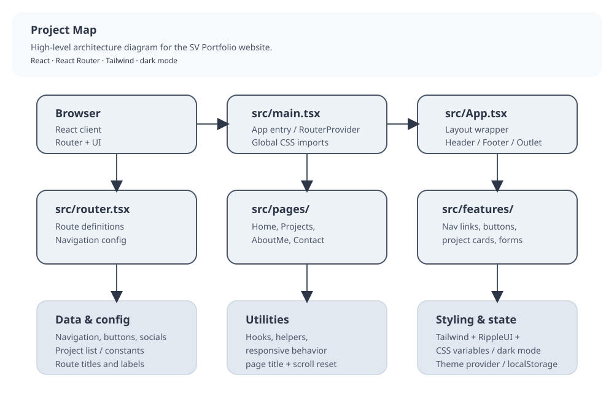

# SV Portfolio



## Project Overview

SV Portfolio is a modern personal portfolio built with React, TypeScript, Vite, Tailwind CSS, and RippleUI. The site combines a polished UI, responsive layouts, dark/light mode support, an animated navigation system, and an integrated contact flow backed by EmailJS.

## Quick Summary

- Single-page app with route-based page composition
- Consistent theme control via CSS variables and `dark`/`light` body classes
- Modular architecture: components, feature modules, hooks, and configs
- Responsive UI with Tailwind utilities and RippleUI enhancements
- Contact form uses `emailjs` and toast-based feedback

## Tech Stack

- React 19
- TypeScript
- Vite
- Tailwind CSS
- RippleUI
- React Router DOM
- React Toastify
- EmailJS Browser
- normalize.css / reset-css

## Architecture

The project follows a component-driven architecture with clear separation of concerns.

### Core entry points

- `src/main.tsx` — application bootstrap, global styles, and `RouterProvider`
- `src/router.tsx` — application routes and child route registration
- `src/App.tsx` — layout shell, global providers, and page rendering via `Outlet`

### Routing structure

Defined in `src/configs/NavigationLinks.config.tsx`:

- `/` — `Home`
- `/aboutme` — `AboutMe`
- `/projects` — `Projects`
- `/projects/:id` — `Project`
- `/contact` — `Contact`
- `*` — `NotFound`

The app uses route metadata and `usePageTitle` to update document titles dynamically.

### Theming and styling

- `tailwind.config.js` enables `darkMode: 'class'`
- Theme variables live in `src/styles/index.css`
- `useDarkMode` manages persistence, body class updates, and theme transitions
- `ThemeSwitchButton` offers a quick toggle for dark/light mode
- RippleUI and Tailwind Forms enhance component styling and interaction

## Project structure

- `src/App.tsx` — root layout and page shell
- `src/main.tsx` — app bootstrap and routing
- `src/router.tsx` — route registration
- `src/assets/` — icons and images
- `src/components/` — reusable UI components
- `src/features/` — higher-level feature components and page sections
- `src/hooks/` — custom hooks and shared behavior
- `src/contexts/` — React context providers
- `src/configs/` — navigation, button, and social configuration
- `src/constants/` — static data and constants
- `src/pages/` — route page views
- `src/styles/` — global theme styles and utility classes
- `src/utils/` — helper functions

## Pages

- `Home` — entry hero section, avatar, CTA buttons, and featured projects
- `AboutMe` — personal introduction and projects showcase
- `Projects` — project gallery with optional full view
- `Project` — individual project detail screen
- `Contact` — contact capture form with EmailJS submission
- `NotFound` — fallback page for unmatched routes

## Core components

### Layout

- `Header`, `Navigation`, `Wrapper`, `Panel`, `Footer`
- `SectionWithTitle` — reusable titled section container
- `ProjectsSection` — project preview and list section

### UI primitives

- `Button`, `Input`, `Link`, `Tooltip`
- `Avatar` — profile image wrapper
- `ButtonGroup` — grouped call-to-action buttons

### Feature modules

- `NavigationLinks` — animated route links with hover effects
- `SocialLinks` — external social icon links
- `HireMeForm` — contact form component
- `ThemeSwitchButton` — theme toggle control
- `CopyEmailButton`, `HireButton`, `ViewAllButton`, `BackHomeButton`

## Hooks and utilities

- `useDarkMode` — theme toggling and persistence
- `useDarkModeContext` — shared theme context
- `useForm` — EmailJS form submission with toast notifications
- `usePageTitle` — dynamic SEO-friendly page titles
- `useScrollToTop` — scroll restoration on route change
- `useProjectsForShowing` — project selection based on route context
- `useDeviceType` — mobile detection for adaptive UI
- `useCircleNavLinkAnimation` — navigation hover animation logic

## Styling notes

- `src/styles/index.css` contains theme variables, base styles, and custom utility classes
- RippleUI provides utility classes such as `btn`, `badge`, `tooltip`, `textarea`, and hover/active effects
- Tailwind Forms plugin improves form control styling
- The theme uses CSS custom properties for both dark and light mode variables

## Configuration and constants

- `src/configs/NavigationLinks.config.tsx` — route definitions, page metadata, and navigation links
- `src/configs/Buttons.config.tsx` — button labels and CTA text
- `src/configs/SocialLinks.config.tsx` — social network icons and URLs
- `src/constants/projects.ts` — project sample data and display limit
- `src/constants/common.ts` — global constants for email, theme, and status

## Environment variables

The contact form requires EmailJS variables in `.env` or `.env.local`:

- `VITE_EMAILJS_SERVICE_ID`
- `VITE_EMAILJS_TEMPLATE_ID`
- `VITE_EMAILJS_PUBLIC_KEY`

## Getting started

Install dependencies and run locally:

```bash
npm install
npm run start
```

Build and preview production output:

```bash
npm run build
npm run preview
```

## Linting and formatting

```bash
npm run lint
npm run lint:fix
npm run format
```

## Developer notes

- The project detail route currently renders placeholder copy and derives project metadata from `src/constants/projects.ts`.
- Dark mode state is synchronized to `localStorage` and applied to the document body.
- Navigation and footer items are config-driven, keeping the experience consistent.

## Contribution guide

- Add pages in `src/pages/` and register them in `src/configs/NavigationLinks.config.tsx`.
- Add project cards and metadata in `src/constants/projects.ts`.
- Extend theme tokens in `src/styles/index.css` and `tailwind.config.js`.
- Create reusable UI primitives in `src/components/` and feature modules in `src/features/`.
